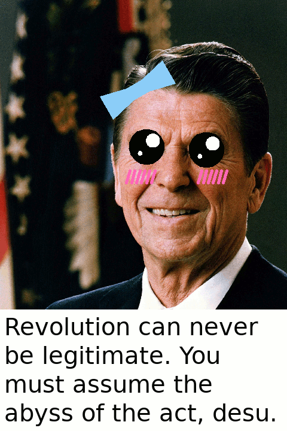

=============
Kawaii Reagan
=============

This is a python package for drawing kawaii shapes on Ronald Reagan's
face using turtle graphics. You can use it for other things, I guess.
It works like so:

.. code-block :: python

    >>> from kawaii_reagan.shapes import Blush, Bow, Eye
    >>> from kawaii_reagan.util import load_reagan
    >>> reagan = load_reagan('reagan.gif')
    >>> right_eye = Eye(center=(5,115), width=60)
    >>> left_eye = Eye(center=(105, 110), width=60)
    >>> right_blush = Blush(center=(-5, 65), width=50, height=20, n=6, weight=5)
    >>> left_blush = Blush(center=(115, 65), width=50, height=20, n=6, weight=5)
    >>> bow = Bow(center=(-10,210), width=60, height=45, rotation=30)
    >>> for shape in [right_eye, left_eye, right_blush, left_blush, bow]:
    >>>     shape.draw()
    >>>
    >>> reagan.exitonclick()

That's what the output is supposed to look like but I don't know how
that text got there. I'm not very good at computers.
